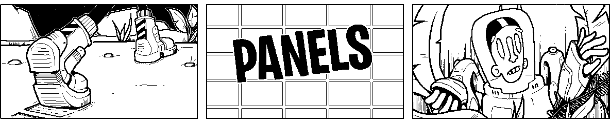

# Panels

Build interactive comics for the Playdate console.



Provide Panels with a Lua table that describes the sequences in your comic (scroll direction, panel sizes, text, animation and effects) along with your layered graphics. Panels will handle layout, scrolling, animation, and even chapter navigation for you.

Comics built with Panels can support these features:

-   layered, parallax scrolling
-   nested panels
-   sequences with different scroll directions
-   manual (crank) scrolling and auto advancing (panel-by-panel)
-   panel effects like shake and blink
-   animated transitions between sequences
-   animations and transitions within panels based on scroll position
-   animated text layers
-   panels with fully custom render functions
-   **NEW!** branching choose-your-own adventure storylines

## Documentation
Check out the full set of documentation here:
### [📄 Panels Documentation](//cadin.github.io/panels)
### [📺 NEW!! Tutorial Videos](https://www.youtube.com/playlist?list=PLvk_cJkKCihbN4Q61lopDtSQMbx4vNLvv)

## Requirements

-   [Playdate SDK](https://play.date/dev/)
-   [Playdate Console](https://shop.play.date) (optional)

## Setup

### From Template Project

1. Clone the [Panels Project Template](https://github.com/cadin/panels-project-template).
    This is a [Template Repo](https://docs.github.com/en/repositories/creating-and-managing-repositories/creating-a-repository-from-a-template). Click "Use this template" to create your own fresh repo with all the contents of the project template.
2. The template project includes the Panels framework as a git submodule. Be sure to properly [initialize the submodule](https://www.w3docs.com/snippets/git/how-to-clone-including-submodules.html) when cloning the repo.
3. Start editing table in `myComicData.lua`.

### Manual Setup

1. Clone this repo into your project into a `libraries` folder.
2. Inside your `main.lua` file import Panels.
3. Create or import your [`comicData`](http://cadin.github.io/panels/docs/comic-data) table.
4. Start Panels with your `comicData` table as the sole argument.

### Example `main.lua` File:

```lua
import "libraries/panels/Panels"
local comicData = {
    -- comic data goes here...
}
Panels.start(comicData)
```

## Support

### Feature Requests

Add feature requests to the [Issues](https://github.com/cadin/panels/issues) page.

Include a description of the general functionality you need, along with your preferred implementation (if you have one). Please search first to see if someone else has already created an issue for your feature. If so, you can add a vote or comment to show your support.

### Bug Reports

File bug reports on the [Issues](https://github.com/cadin/panels/issues) page.

Each bug should be listed as a separate issue. Please search first to see if someone else has already filed the bug, and list all steps needed to reproduce the issue in the smallest possible project.

### Contribute

If you would like to contribute a feature or bug fix please contact me first and let me know which issue you want work on. If there isn't yet an issue for your proposed change, go ahead and write one.

## License

Panels is licensed under a [Creative Commons Attribution 4.0 International License](https://creativecommons.org/licenses/by/4.0/).

**TLDR:** You can use or this code (or modified versions) to create anything you want, public or private, free or commercial. For attribution, please retain the Panels credit (with URL and QR code) on the Credits page of your game so that others may find their way here.

---

👨🏻‍🦲❤️🛠
